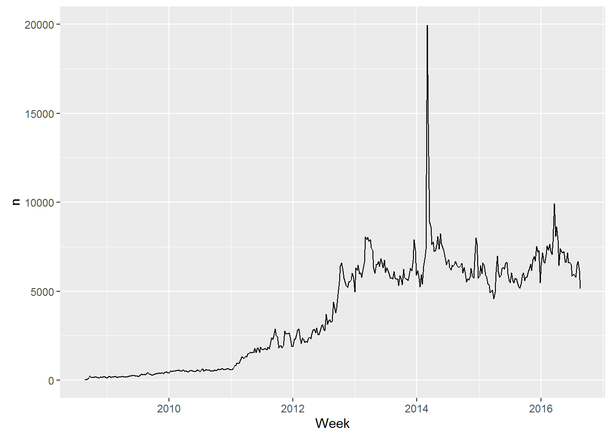
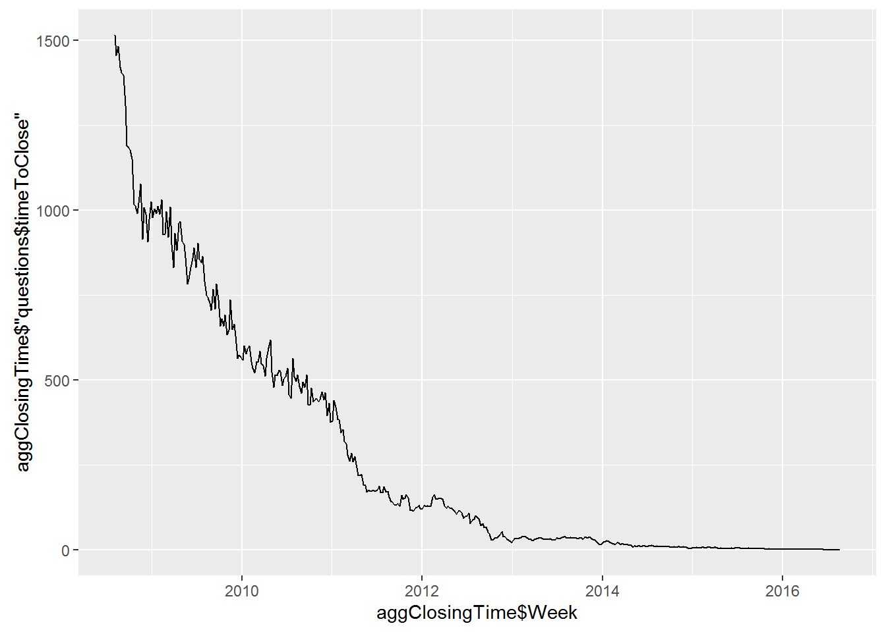
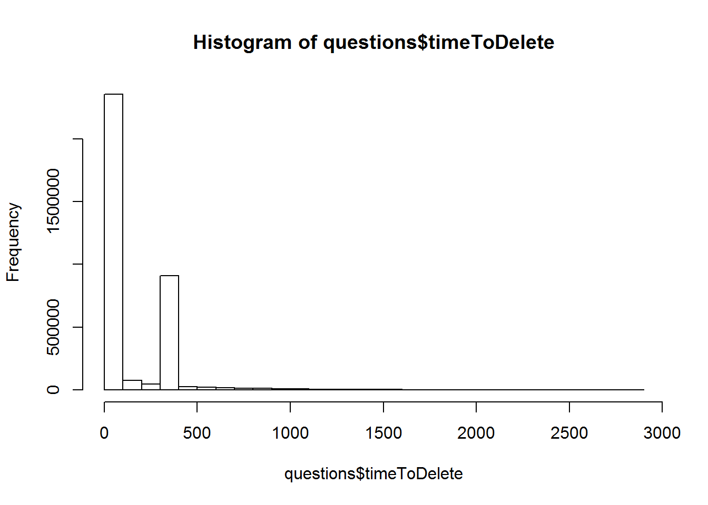

### questions
First, let's investigate the *questions* dataframe.  There are 15806951 rows and 11 columns in *questions*; now let's take a quick look at what each column represents:

```r
head(questions,10)
```

```
## # A tibble: 10 × 7
##       Id        CreationDate          ClosedDate        DeletionDate Score
##    <int>              <dttm>              <dttm>              <dttm> <int>
## 1      1 2008-07-31 21:26:37                <NA> 2011-03-28 00:53:47     1
## 2      4 2008-07-31 21:42:52                <NA>                <NA>   418
## 3      6 2008-07-31 22:08:08                <NA>                <NA>   188
## 4      8 2008-07-31 23:33:19 2013-06-03 04:00:25 2015-02-11 08:26:40    42
## 5      9 2008-07-31 23:40:59                <NA>                <NA>  1306
## 6     11 2008-07-31 23:55:37                <NA>                <NA>  1062
## 7     13 2008-08-01 00:42:38                <NA>                <NA>   425
## 8     14 2008-08-01 00:59:11                <NA>                <NA>   272
## 9     16 2008-08-01 04:59:33                <NA>                <NA>    68
## 10    17 2008-08-01 05:09:55                <NA>                <NA>   103
## # ... with 2 more variables: OwnerUserId <int>, AnswerCount <int>
```

Next I want some overall summary statistics:

```r
library(dplyr)
# This took forever to run
#summary(questions)
# This ran very fast
questions %>% sample_n(size=100000) %>% summary()
```

```
##        Id            CreationDate                
##  Min.   :      19   Min.   :2008-08-01 05:21:22  
##  1st Qu.:11938480   1st Qu.:2012-08-13 16:33:16  
##  Median :21571118   Median :2014-02-05 07:28:47  
##  Mean   :21034252   Mean   :2013-11-15 00:15:04  
##  3rd Qu.:30456193   3rd Qu.:2015-05-26 10:40:04  
##  Max.   :39089497   Max.   :2016-08-22 22:10:52  
##                                                  
##    ClosedDate                   DeletionDate                
##  Min.   :2008-09-04 15:14:49   Min.   :2008-08-16 02:37:10  
##  1st Qu.:2013-03-10 03:16:48   1st Qu.:2013-07-12 03:00:01  
##  Median :2014-04-10 03:05:42   Median :2014-09-15 03:00:01  
##  Mean   :2014-03-19 04:26:11   Mean   :2014-06-18 19:25:58  
##  3rd Qu.:2015-06-27 07:11:11   3rd Qu.:2015-09-08 20:28:56  
##  Max.   :2016-08-23 07:42:06   Max.   :2016-08-23 16:18:22  
##  NA's   :89947                 NA's   :77591                
##      Score           OwnerUserId       AnswerCount      timeToClose     
##  Min.   : -24.000   Min.   :      4   Min.   :-3.000   Min.   :   0.00  
##  1st Qu.:   0.000   1st Qu.: 646565   1st Qu.: 1.000   1st Qu.:   0.03  
##  Median :   0.000   Median :1560697   Median : 1.000   Median :   0.18  
##  Mean   :   1.153   Mean   :2089195   Mean   : 1.443   Mean   :  81.57  
##  3rd Qu.:   1.000   3rd Qu.:3241846   3rd Qu.: 2.000   3rd Qu.:   1.00  
##  Max.   :2440.000   Max.   :6745398   Max.   :32.000   Max.   :2704.81  
##                     NA's   :23319     NA's   :10238    NA's   :89947    
##   timeToDelete       closed         deleted       
##  Min.   :   0.00   Mode :logical   Mode :logical  
##  1st Qu.:   0.91   FALSE:89947     FALSE:77591    
##  Median :  30.78   TRUE :10053     TRUE :22409    
##  Mean   : 147.35   NA's :0         NA's :0        
##  3rd Qu.: 366.21                                  
##  Max.   :2592.85                                  
##  NA's   :77591
```
Hunh. Normally I would run summary() in order to get summary statistics on all the fields in one place, but it looks like summary() is not performant on 46M records, though it's very fast to grab a sample of 100k records and run summary() on that, so I have a reasonable idea of the summary statistics for the full dataset.

We'll do summaries of the complete set of rows as we look at each column in turn.


#### CreationDate


```r
library(dplyr)
# This took forever to run
#t(questions %>% summarize_at(vars(CreationDate),funs(min,quantile,max,mean,sd)))
t(questions %>% summarize_at(vars(CreationDate),funs(min,median,max,mean)))
```

```
##        [,1]                 
## min    "2008-07-31 21:26:37"
## median "2014-02-11 10:37:03"
## max    "2016-08-22 23:58:42"
## mean   "2013-11-17 01:44:26"
```

```r
questions %>% 
  filter(!is.na(CreationDate)) %>%
  summarize(n())
```

```
## # A tibble: 1 × 1
##      `n()`
##      <int>
## 1 15806951
```
OIC.  summary() is slow because it's computing order statistics (quartiles) -- [dplyr](https://cran.r-project.org/web/packages/dplyr/dplyr.pdf)'s summarize() chokes on quantile() with 46M records.  This is a good reminder to be wary when working with larger data, and that R's standard summary statistics are not optimized for larger data; there doesn't seem to be an option for computing estimated, rather than exact, sample quartiles.

So we can get some of the summary statistics quickly and easily, though I can't seem to get count() or n() to work within funs() of summarize(); ideally, I want to compute the number of missing values during the same data pass where I'm calculating the other summary statistics.

More illuminating than the summary statistics is the plot of the number of new questions created per week (from David's original post):

```r
library(ggplot2)
library(lubridate)

questions %>%
  count(Week = round_date(CreationDate, "week")) %>%
  ggplot(aes(Week, n)) +
  geom_line()
```


A few things to note:
* There's a changepoint in the series.  The graph shows a steady increase in the number of questions asked from July 2008 to the start of 2014, where the series reaches a steady state.  
* There's clear yearly seasonality when the number of new questions drops precipitously in the last week of the year.
* There's potentially interesting yearly seasonality where the number of new questions is higher in Q1 (as everyone tries to keep their New Year's resolutions to learn more about some new language?) but the visual evidence isn't strong.


#### ClosedDate

In order to get summary statistics for ClosedDate using dplyr, I need to filter out the NAs.  

```r
library(dplyr)
# This gave all NAs
t(questions %>% summarize_at(vars(ClosedDate),funs(min,median,max,mean)))
```

```
##        [,1]
## min    NA  
## median NA  
## max    NA  
## mean   NA
```

```r
# This gave what I was looking for.
questions %>% 
  filter(!is.na(ClosedDate)) %>%
  summarize(n())
```

```
## # A tibble: 1 × 1
##     `n()`
##     <int>
## 1 1577138
```

```r
questions %>% 
  filter(!is.na(ClosedDate)) %>%
  summarize_at(vars(ClosedDate),funs(min,median,max,mean)) %>%
  t()
```

```
##        [,1]                 
## min    "2008-08-21 13:15:20"
## median "2014-04-21 03:45:03"
## max    "2016-08-23 19:50:21"
## mean   "2014-03-23 11:26:23"
```

Again, these summary statistics themselves are not particularly interesting, except that the number of closed questions is about 10% of the overall number of questions.

Adapting David's plot of the number of questions created per week, let's look at the number of questions closed per week:


```r
library(ggplot2)
library(lubridate)

questions %>%
  count(Week = round_date(ClosedDate, "week")) %>%
  ggplot(aes(Week, n)) +
  ylim(0,20000) +
  geom_line()
```



This starts to get at the question of the rate of question closure over time, because we can see the pattern of question closure in the plot.  A few things to note:
* Like the number of questions asked per week, the number of questions closed per week increases until it reaches a steady state
* Unlike the number of questions asked per week, the number of questions closed appears to have two changepoints.  The number of questions closed per week increases slowly from July 2008 until the end of 2010, when the slope changes from Jan 2011 to the end of 2012, at which point it reaches its steady state
* There isn't a clear seasonal dip in the number of questions closed at the end of the year
* There is a serious outlier in early 2014 where nearly 20,000 questions were closed in a single week. Is this an administrative action?


We might also want to examine how long it takes before a question is closed, and how that changes over time.  


```r
questions$timeToClose <- as.numeric(difftime(questions$ClosedDate,questions$CreationDate,units="days"))
questions %>% 
  filter(!is.na(timeToClose)) %>%
  summarize_at(vars(timeToClose),funs(min,median,max,mean)) %>%
  t()
```

```
##                [,1]
## min    4.629630e-05
## median 1.707060e-01
## max    2.930478e+03
## mean   7.486537e+01
```

```r
hist(questions$timeToClose)
```


```r
Week <- round_date(questions$CreationDate, "week")
aggClosingTime <- aggregate(questions$timeToClose ~ Week, data=questions, mean)
ggplot(aggClosingTime, aes(aggClosingTime$Week,aggClosingTime$'questions$timeToClose')) + geom_line()
```



Not entirely surprisingly, questions created further in the past have had more time to be closed.  However, the time to close questions also has a highly skewed distribution, so the distribution of time to close those early questions could be skewed by a few questions that took a long time to close.


```
##               [,1]
## min       1.000012
## median   20.906545
## max    2930.477755
## mean    305.454393
```

#### DeletionDate

```r
library(dplyr)
questions %>% 
  filter(!is.na(DeletionDate)) %>%
  summarize(n())
```

```
## # A tibble: 1 × 1
##     `n()`
##     <int>
## 1 3527214
```

```r
questions %>% 
  filter(!is.na(DeletionDate)) %>%
  summarize_at(vars(DeletionDate),funs(min,median,max,mean)) %>%
  t()
```

```
##        [,1]                 
## min    "2008-08-01 13:18:31"
## median "2014-09-25 19:32:04"
## max    "2016-08-23 19:50:08"
## mean   "2014-06-26 07:32:09"
```

More than twice as many questions have been deleted than closed.  

Number of questions deleted per week:


```r
library(ggplot2)
library(lubridate)

questions %>%
  count(Week = round_date(DeletionDate, "week")) %>%
  ggplot(aes(Week, n)) +
  ylim(0,50000) +
  geom_line()
```


Similarly, this starts to get at the question of the rate of question deletion over time. Some things to note:
* Like number of questions closed, the number of questions deleted appears to have two changepoints.  The number of questions deleted per week increases slowly from July 2008 until the end of 2010, when the slope changes from Jan 2011 to the end of 2014, at which point it may have reached its steady state -- this is difficult to tell, because there hasn't been much time to judge whether this is so.
* There are many more "outlying" points in this chart.  2013-2014 is an especially chaotic period. 


We might also want to examine how long it takes before a question is deleted, and how that changes over time.  


```r
questions$timeToDelete <- as.numeric(difftime(questions$DeletionDate,questions$CreationDate,units="days"))
questions %>% 
  filter(!is.na(timeToDelete)) %>%
  summarize_at(vars(timeToDelete),funs(min,median,max,mean)) %>%
  t()
```

```
##                [,1]
## min    1.157407e-05
## median 3.072476e+01
## max    2.888135e+03
## mean   1.459521e+02
```

```r
hist(questions$timeToDelete)
```



```r
aggDeletionTime <- aggregate(questions$timeToDelete ~ Week, data=questions, mean)
ggplot(aggDeletionTime, aes(aggDeletionTime$Week,aggDeletionTime$'questions$timeToDelete')) + geom_line()
```


As with questions closed, questions created further in the past have had more time to be deleted, with the same concerns about the skewed distribution for time to delete.  However, there are a couple of oddities to note:
* The distribution of time to delete is bimodal. The expected highly-skewed distribution is broken up by a spike around... could that be 365 days?  Is there an administrative job that auto-deletes questions after a year?
* There is a sudden dropoff in the plot of time to delete over time. If there is an admin job that auto-deletes questions, then this dropoff is likely due to the fact that the yearly admin job hasn't yet affected questions opened after the dropoff.


```
##    Var1  Var2     Freq
## 1 FALSE FALSE 11740327
## 2  TRUE FALSE   539410
## 3 FALSE  TRUE  2489486
## 4  TRUE  TRUE  1037728
```

```
## Error in eval(substitute(expr), envir, enclos): wrong result size (2), expected 15806951 or 1
```

#### Score

```r
library(dplyr)
questions %>% 
  filter(!is.na(Score)) %>%
  summarize_at(vars(Score),funs(min,median,max,mean)) %>%
  t()
```

```
##                [,1]
## min     -154.000000
## median     0.000000
## max    15422.000000
## mean       1.193366
```

There's a wide range of values for question Score, with the median smack at 0. This is an instance where it would be great to have Q1 and Q3, so that we'd know to expect a cruddy histogram:


```r
ggplot(data=questions, aes(questions$Score)) + geom_histogram()
```


The histogram is dominated by the 0 values; nearly half of the questions asked have a 0 score.


```r
questions %>%
  filter(Score==0) %>%
  dim()
```

```
## [1] 7722026      11
```

However, even when you remove all the 0's, the histogram is still dominated by small values:


```r
questions %>%
  filter(Score!=0) %>%

  ggplot(data=filter(questions,Score!=0), aes(Score)) + geom_histogram()
```

```
## Error: Mapping should be created with `aes() or `aes_()`.
```

Focusing in on the values closest to 0, we get a slightly better view of the distribution of values.   


```r
ggplot(data=questions, aes(questions$Score)) + xlim(-10, 10) + geom_histogram()
```


#### OwnerUserId
Number of unique users who have asked questions:

```r
length(unique(questions$OwnerUserId))
```

```
## [1] 2296759
```

A listing of the users who have asked the most questions, presented in two different ways:

```r
uniqueOwners <- as.data.frame(table(questions$OwnerUserId))
head(uniqueOwners[order(-uniqueOwners$Freq),],20)
```

```
##           Var1 Freq
## 370326  875317 2095
## 14338    39677 2084
## 2854      4653 1801
## 13038    34537 1659
## 50971   179736 1507
## 34607   117700 1463
## 182439  470184 1394
## 264143  651174 1359
## 509818 1194415 1357
## 42908   149080 1289
## 4613      8741 1255
## 21004    65387 1229
## 25875    84201 1192
## 113979  325418 1191
## 42278   146780 1146
## 199575  508127 1113
## 326524  784597 1112
## 2846      4639 1109
## 165189  434051 1099
## 35903   122536 1094
```

```r
uniqueOwners2 <- count(questions, c(questions$OwnerUserId))
head(uniqueOwners2[order(-uniqueOwners2$n),],20)
```

```
## # A tibble: 20 × 2
##    `c(questions$OwnerUserId)`       n
##                         <int>   <int>
## 1                          NA 3668649
## 2                      875317    2095
## 3                       39677    2084
## 4                        4653    1801
## 5                       34537    1659
## 6                      179736    1507
## 7                      117700    1463
## 8                      470184    1394
## 9                      651174    1359
## 10                    1194415    1357
## 11                     149080    1289
## 12                       8741    1255
## 13                      65387    1229
## 14                      84201    1192
## 15                     325418    1191
## 16                     146780    1146
## 17                     508127    1113
## 18                     784597    1112
## 19                       4639    1109
## 20                     434051    1099
```

I prefer the latter because I get the NAs by default. 3.6M questions where we don't have a user ID for the asker is significant.


#### AnswerCount

```r
library(dplyr)
questions %>% 
  filter(!is.na(AnswerCount)) %>%
  summarize_at(vars(AnswerCount),funs(min,median,max,mean)) %>%
  t()
```

```
##              [,1]
## min     -5.000000
## median   1.000000
## max    518.000000
## mean     1.444817
```

How do you get a negative AnswerCount?!

Histogram of number of answers to a question:

```r
ggplot(data=questions, aes(questions$AnswerCount)) + geom_histogram()
```


Like Score, the number of answers is dominated by small counts. Focusing in on the values closest to 0, we get a slightly better view of the distribution of values.


```r
ggplot(data=questions, aes(questions$AnswerCount)) + xlim(-5, 10)  + geom_histogram()
```


